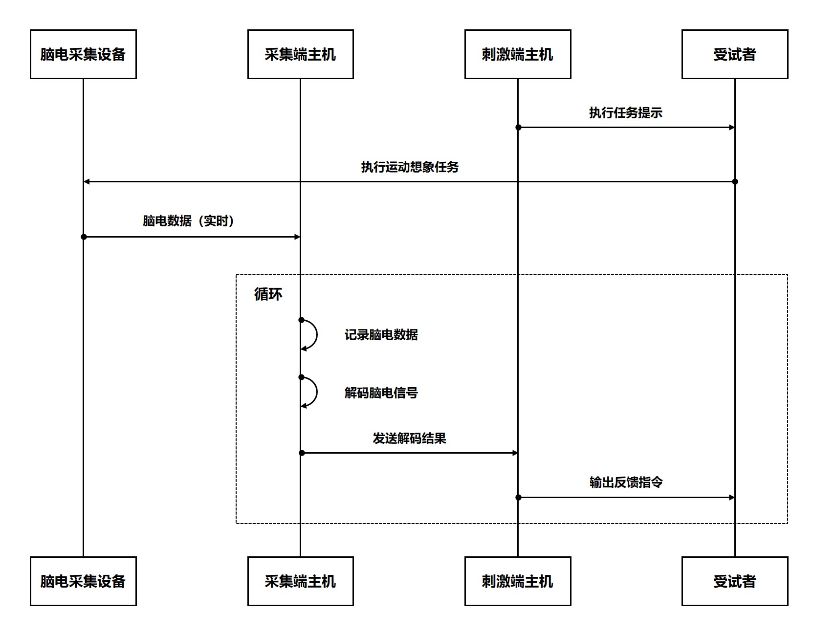

# 脑机接口在线识别与反馈系统

[](https://opensource.org/licenses/MIT)
[](https://www.mathworks.com/products/matlab.html)

中文版本 | [English Version](./README.en.md)

## 目录
- [1. 项目简介](#1-项目简介)
- [2. 功能特性](#2-功能特性)
- [3. 安装与依赖](#3-安装与依赖)
- [4. 使用说明](#4-使用说明)
- [5. 系统架构](#5-系统架构)
- [6. 示例图像](#6-示例图像)
- [7. 引用与参考文献](#7-引用与参考文献)
- [8. 相关研究资源](#8-相关研究资源)
- [9. 作者与贡献者](#9-作者与贡献者)
- [10. 许可协议](#10-许可协议)


<a id="1-项目简介"></a>

## 1. 项目简介

本项目是一个完整的脑机接口(BCI)软件系统，由两个协同工作的MATLAB应用程序组成：

- **AcquisitionClient**：脑电数据采集、处理与反馈控制系统  
  实现脑电信号的实时采集、在线处理、特征提取、模型训练与评估，以及基于运动想象的实时反馈控制。

- **StimulateClient**：运动想象心理任务诱导与反馈呈现系统  
  提供标准运动想象实验范式，执行视听任务提示，并实时呈现脑机接口解码结果作为反馈。

本系统为脑机接口研究提供了完整的实验平台，特别适用于：
- 🧠 运动想象脑电解码研究
- 🤖 脑机接口算法开发与评估
- 🔁 神经反馈训练系统
- 🎮 脑控设备交互研究

[](https://www.bilibili.com/video/BV1UT42167xb/?vd_source=688a96f2275da749eb2dd276281528c4)


<a id="2-功能特性"></a>

## 2. 功能特性

### 🧪 AcquisitionClient - 脑电数据采集与处理系统

<div style="display: flex; justify-content: center; margin: 20px 0">
<div style="width: 90%">

| 功能类别 | 详细功能 | 技术特点 |
|----------|----------|----------|
| **数据采集** | • 实时采集NeuroScan脑电数据<br>• 阻抗监测与显示<br>• 多通道数据可视化 | • 支持NeuroScan实时数据流<br>• 低延迟数据采集 |
| **信号处理** | • 带通滤波(1-40Hz可调)<br>• ICA伪迹去除<br>• 黎曼空间滤波(RSF)<br>• 共空间模式(CSP) | • 实时处理流水线<br>• 可配置处理参数<br>• 支持多种空间滤波算法 |
| **特征分析** | • 时域分析(ERP)<br>• 频域分析(PSD)<br>• 时频分析(ERSP)<br>• 脑地形图可视化 | • 多维度特征提取<br>• 交互式可视化<br>• 特征选择工具 |
| **机器学习** | • 模型训练与评估<br>• 迁移学习框架<br>• 实时脑电信号解码<br>• **支持多种分类算法** | • 支持多种分类算法<br>• 迁移学习框架<br>• 在线自适应学习<br>• 详见下方算法列表 |
| **反馈控制** | • UDP指令传输<br>• 实时解码结果反馈<br>• 系统状态监控 | • 低延迟通信<br>• 可配置反馈参数 |

</div>
</div>

### 支持的分类算法

<div style="display: flex; justify-content: center; margin: 20px 0">
<div style="width: 90%">

| 算法名称 | 关键参数 | 函数接口 |
|----------|----------|----------|
| **CSP** | • `nFilters`: 滤波器数量<br>• `classifierType`: 分类器类型 | `model = csp_modeling(traindata, trainlabel, nFilters, classifierType)`<br>`[predlabel, decision_values, testacc] = csp_classify(model, testdata, testlabel)` |
| **FBCSP** | • `freqsbands`: 频带范围数组<br>• `nFilters`: 滤波器数量<br>• `fs`: 采样率 | `model = fbcsp_modeling(traindata, trainlabel, nFilters, fs, freqsbands)`<br>`[predlabel, decision_values, testacc] = fbcsp_classify(model, testdata, testlabel)` |
| **FgMDM** | • `metric`: 距离度量 | `model = fgmdm_modeling(traindata,trainlabel,metric)`<br>`[predlabel, decision_values, testacc] = fgmdm_classify(model, testdata, testlabel)` |
| **TSM** | • `classifierType`: 分类器类型<br>• `optimize`: 是否自动优化分类器参数<br>• `timeLimit`: 分类器参数优化的最大时间限制 | `model = tsm_modeling(traindata, trainlabel, classifierType, optimize, timeLimit)`<br>`[predlabel, decision_values, testacc] = tsm_classify(model, testdata, testlabel)` |
| **TRCA** | - | `model = trca_modeling(traindata, trainlabel)`<br>`[predlabel, decision_values, testacc] = trca_classify(model, testdata, testlabel)` |
| **DCPM** | - | `model = dcpm_modeling(traindata, trainlabel)`<br>`[predlabel, decision_values, testacc] = dcpm_classify(model, testdata, testlabel)` |
| **SBLEST** | • `tau`: 时间延迟参数 | `model = sblest_modeling(traindata, trainlabel, tau)`<br>`[predlabel, decision_values, testacc] = sblest_classify(model, testdata, testlabel)` |
| **CTSSP** | • `t_win`: 时间窗单元数组<br>• `tau`: 时间延迟参数 | `model = ctssp_modeling(traindata, trainlabel, t_win, tau)`<br>`[predlabel, decision_values, testacc] = ctssp_classify(model, testdata, testlabel)` |
| **ENSEMBLE** | • `alg`: 基础算法列表<br>• `useDecisionValues`: 使用决策值/预测值 | 集成多个基础算法的分类结果进行元学习<br>`model = p_modeling(traindata, trainlabel, alg, varargin)`<br>`[predlabel, decision_values, testacc] = p_classify(model, testdata, testlabel)` |
| **RSFDA**<br>(用于迁移学习) | • `fs`: 采样率<br>• `times`: 时间窗参数<br>• `freqs`: 频带参数<br>• `chans`: 通道参数 | `model = rsfda_modeling(Xs, Ys, Xt, Yt, fs, times, freqs, chans)`<br>`[predlabel, decision_values, testacc] = rsfda_classify(model, testdata, testlabel)` |
| **Stacking** | • `algs`: 基础算法列表<br>• `fs`: 采样率<br>• `times`: 时间窗参数<br>• `freqs`: 频带参数<br>• `chans`: 通道参数 | 集成多个基础算法和时间窗、频带、导联参数配置的分类结果进行元学习<br>`model = stacking_modeling(data, label, algs, fs, times, freqs, chans, varargin)`<br>`[predlabel, decision_values, testacc] = stacking_classify(model, testdata, testlabel)` |
| **Stacking**<br>(用于迁移学习) | • `algs`: 基础算法列表<br>• `fs`: 采样率<br>• `times`: 时间窗参数<br>• `freqs`: 频带参数<br>• `chans`: 通道参数 | 集成多个基础算法和时间窗、频带、导联参数配置的分类结果进行元学习<br>`model = stacking_tlmodeling(Xs, Ys, Xt, Yt, algs, fs, times, freqs, chans, varargin)`<br>`[predlabel, decision_values, testacc] = stacking_tlclassify(model, testdata, testlabel)` |

> **注意**：以上函数接口为示例，实际使用时请根据具体实现进行调整，部分算法参数未列出，详见源码。

</div>
</div>


### 🎮 StimulateClient - 实验范式与反馈系统

<div style="display: flex; justify-content: center; margin: 20px 0">
<div style="width: 90%">

| 功能类别 | 详细功能 | 技术特点 |
|----------|----------|----------|
| **实验范式** | • 左右手运动想象范式<br>• 视觉/听觉任务提示<br>• 实验参数配置 | • 标准化实验流程<br>• 精确时序控制 |
| **反馈呈现** | • 实时解码结果可视化<br>• 游戏化反馈界面<br>• 多模态反馈(视觉+听觉) | • 沉浸式反馈体验<br>• 可定制反馈形式 |
| **数据记录** | • 实验数据自动保存<br>• 被试响应记录<br>• 时间戳同步 | • 标准化数据格式<br>• 与脑电数据同步 |
| **系统控制** | • 实验流程控制<br>• UDP通信管理<br>• 系统状态监控 | • 可靠通信协议<br>• 错误处理机制 |

</div>
</div>


<a id="3-安装与依赖"></a>

## 3. 安装与依赖

### 系统要求
- **操作系统**：Windows 10/11 (64位)
- **MATLAB**：R2021b 或更高版本
- **硬件要求**：
  - 处理器：Intel Core i7 或同等性能
  - 内存：16GB RAM 或更高
  - 存储：1GB 可用空间
  - NeuroScan EEG采集设备

### 必要工具箱

1. Signal Processing Toolbox
2. Statistics and Machine Learning Toolbox
3. Parallel Computing Toolbox (推荐)
4. Psychtoolbox-3 (推荐)


### 安装步骤
1. 克隆或下载项目仓库：
   ```bash
   git clone https://github.com/PLC-TJU/NEUROSTREAM.git
   cd NEUROSTREAM
   ```
2. 在MATLAB中添加项目路径：
    ```matlab
    % 在采集端主机添加路径
    addpath(genpath('AcquisitionClient'));
    savepath;  % 保存路径设置

    % 在反馈端主机添加路径
    addpath(genpath('StimulateClient'));
    savepath;  % 保存路径设置
   ```
3. 安装必要工具箱：
    ```matlab
    % 采集端主机安装工具箱
    toolboxes = {'Signal Processing Toolbox', ...
              'Statistics and Machine Learning Toolbox', ...
              'Parallel Computing Toolbox'};

    for i = 1:length(toolboxes)
        if ~license('test', toolboxes{i}) || isempty(ver(toolboxes{i}))
            warning('%s 未安装，请通过MATLAB附加功能管理器安装', toolboxes{i});
        end
    end

    % 反馈端主机安装Psychtoolbox (可选)
    if ~exist('PsychtoolboxVersion', 'file')
        web('https://psychtoolbox.org/download.html', '-browser');
        disp('请按照说明安装Psychtoolbox');
    end
    ```


<a id="4-使用说明"></a>

## 4. 使用说明

**系统启动前准备**
1. 确保NeuroScan设备正常连接并启动配套软件（Scan/Curry）
2. 在NeuroScan软件中启用实时数据传输端口
3. 确保采集端和反馈端主机在同一局域网
4. 配置网络防火墙允许UDP通信（默认端口4000和9095）

**采集端运行流程**
```matlab
% 启动采集端
AcquisitionClient;

% 典型工作流程：
% 1. [设置] -> 配置NeuroScan连接参数和受试者信息
% 2. [数据] -> 加载历史数据或采集新训练数据
% 3. [分析] -> 执行特征分析与时频可视化
% 4. [模型] -> 训练分类模型并评估性能
% 5. [部署] -> 启动实时解码引擎
% 6. [连接] -> 配置UDP反馈连接
% 7. [控制] -> 启动实时脑电解码与反馈控制
```

**反馈端运行流程**
```matlab
% 启动反馈端
StimulateClient;

% 典型工作流程：
% 1. [设置] -> 配置实验参数(任务类型、时长、试次数、受试者信息等)
% 2. [网络] -> 设置UDP通信参数(IP、端口)
% 3. [连接] -> 连接采集端
% 4. [实验] -> 启动实验范式
% 5. [监控] -> 观察实验进程与反馈呈现
% 6. [数据] -> 保存实验数据
```

**双系统协同工作流程**

<p align="center"> 
 
<br> 
<em>图1：系统工作流程</em> 
</p>

<a id="5-系统架构"></a>

## 5. 系统架构

### 整体架构

<p align="center"> 

<br>
<em>图2：整体架构</em>
</p>

### 采集端架构
```text
AcquisitionClient/
├── HelpSystem/                # 帮助文档系统
│   ├── createAboutDialog.m    # "关于"对话框
│   ├── createManualDialog.m   # 用户手册
├── Resources/                 # 资源文件
│   ├── Icons/                 # 图标资源
│   ├── Images/                # 图像资源
├── Utils/                     # 工具函数
│   ├── Machine_Learning_Classification/
│   │   ├── Classification/    # 分类算法
│   │   ├── Feature_Analysis/  # 特征分析方法
│   │   ├── Model_Evaluation/  # 模型评估工具
│   │   ├── Pre_Processing/    # 预处理方法
│   │   ├── model_training.m   # 标准模型训练
│   │   ├── online_classify.m  # 在线分类
│   │   ├── tlmodel_training.m # 迁移学习模型训练
│   ├── NeuroScan/             # NeuroScan接口工具
│   ├── ...                    # 其他工具
├── AcquisitionClient.mlapp    # 主应用程序
├── ConfigManager.m            # 配置管理类
├── DataProcessor.m            # 数据处理核心类
├── FileManager.m              # 文件管理类
├── NeuroScanClient.m          # NeuroScan客户端类
├── UDPComm.m                  # UDP通信类
```

### 反馈端架构
```text
StimulateClient/
├── Paradigms/                 # 实验范式实现
│   ├── stimulate_auto.m       # 运动想象游戏范式
│   └── stimulate_plc.m        # 运动想象时频范式(需要Psychtoolbox-3)
├── Resources/                 # 资源文件
│   ├── Audio/                 # 音频资源
│   ├── Images/                # 图像资源
│   └── Videos/                # 视频资源
├── Utils/                     # 工具函数
├── StimulateClient.mlapp      # 主应用程序
```


<a id="6-示例图像"></a> 

## 6. 示例图像

<p align="center">  

<br>
<em>图3：采集端主界面</em>
<br>
<br>

<br>
<em>图4：反馈端主界面</em>
</p>


<a id="7-引用与参考文献"></a>

## 7. 引用与参考文献
如您使用本系统或相关算法进行研究，请引用以下文献：

```bibtex
@article{pan2025rsf,
  title={Enhancing Motor Imagery EEG Classification with a Riemannian Geometry-Based Spatial Filtering (RSF) Method}, 
  author={Lincong, Pan and Kun, Wang and Yongzhi Huang and Xinwei, Sun and Jiayuan Meng and Weibo Yi and Minpeng, Xu and Tzyy-Ping Jung and Dong, Ming},
  journal={Neural Networks},
  year={2025},
  volume={188},
  pages={107511},
  doi={10.1016/j.neunet.2025.107511},
  publisher={Elsevier}
}
```
```bibtex
@article{pan2023rave,
  title={Riemannian geometric and ensemble learning for decoding cross-session motor imagery electroencephalography signals}, 
  author={Lincong, Pan and Kun, Wang and Lichao Xu and Xinwei, Sun and Weibo Yi and Minpeng, Xu and Dong, Ming},
  journal={Journal of Neural Engineering},
  year={2023},
  volume={20},
  number={6},
  pages={066011},
  doi={10.1088/1741-2552/ad0a01},
  publisher={IOP Publishing}
}
```
```bibtex
@article{pan2025rsfda,
  title={基于黎曼空间滤波与域适应的跨时间运动想象-脑电解码研究}, 
  author={潘林聪, 孙新维, 王坤, 曹愉培, 许敏鹏, 明东},
  journal={生物医学工程学杂志},
  month={4},
  year={2025},
  volume={42},
  number={2},
  pages={272-279},
  doi={10.7507/1001-5515.202411035},
  issn={1001-5515},
}
```
```bibtex
@article{pan2025ctssp,
  title={CTSSP: A Temporal-Spectral-Spatio Joint Optimization Algorithm for Motor Imagery EEG Decoding}, 
  author={Lincong, Pan and Kun, Wang and Weibo Yi and Yang Zhang and Minpeng, Xu and Dong, Ming},
  journal={TechRxiv},
  month={4},
  year={2025},
  doi={10.36227/techrxiv.174431208.89304915/v1}
}
```


<a id="8-相关研究资源"></a>

## 8. 相关研究资源
本项目的实现基于以下开源项目，特此致谢：
- [</img>](https://github.com/PLC-TJU/NeuroDeckit) 
EEG信号全流程处理工具箱
- [</img>](https://github.com/PLC-TJU/RSF) 
基于黎曼几何的空间滤波算法
- [</img>](https://github.com/PLC-TJU/RSFDA) 
黎曼空间滤波与域适应算法
- [</img>](https://github.com/PLC-TJU/CTSSP) 
公共时间-频谱-空间模式算法
- [</img>](https://github.com/PLC-TJU/RAVE) 
基于黎曼几何的自适应增强与集成学习算法
- [</img>](https://github.com/alexandrebarachant/covariancetoolbox) 
一个专注于黎曼几何方法的MATLAB工具箱
- [</img>](https://github.com/EEGdecoding/Code-SBLEST) 
基于稀疏朴素贝叶斯学习的脑电解码方法
- [</img>](https://github.com/sccn/eeglab) 
EEG信号处理的开源MATLAB工具箱


<a id="9-作者与贡献者"></a> 

## 9. 作者与贡献者

**核心开发者**

- 作者: 潘林聪 (Lincong Pan)
- 邮箱: panlincong@tju.edu.cn
- 机构: 天津大学

**其他贡献者**
- 暂无

<a id="10-许可协议"></a> 


## 10. 许可协议

本项目使用MIT许可协议。   
完整的许可证文件请查看 [LICENSE](./LICENSE) 文件。
```text
MIT License

Copyright (c) 2023-2025 潘林聪

特此免费授予获得本软件及相关文档文件（以下简称“软件”）副本的任何人无限制地处理软件的权限，
包括但不限于使用、复制、修改、合并、发布、分发、再许可和/或销售软件的副本的权利，
并允许接受软件的人这样做，但须符合以下条件：

上述版权声明和本许可声明应包含在软件的所有副本或主要部分中。

本软件按"原样"提供，不提供任何形式的明示或暗示保证，包括但不限于适销性、特定用途适用性和非侵权保证。
在任何情况下，作者或版权持有人均不对因软件或使用或其他交易引起的任何索赔、损害赔偿或其他责任承担责任，
无论是合同诉讼、侵权诉讼还是其他诉讼。
```


## 
最后更新: 2025年6月23日  
项目维护: 潘林聪 (Lincong Pan)  
项目主页: https://github.com/PLC-TJU/NEUROSTREAM  
联系邮箱: panlincong@tju.edu.cn  