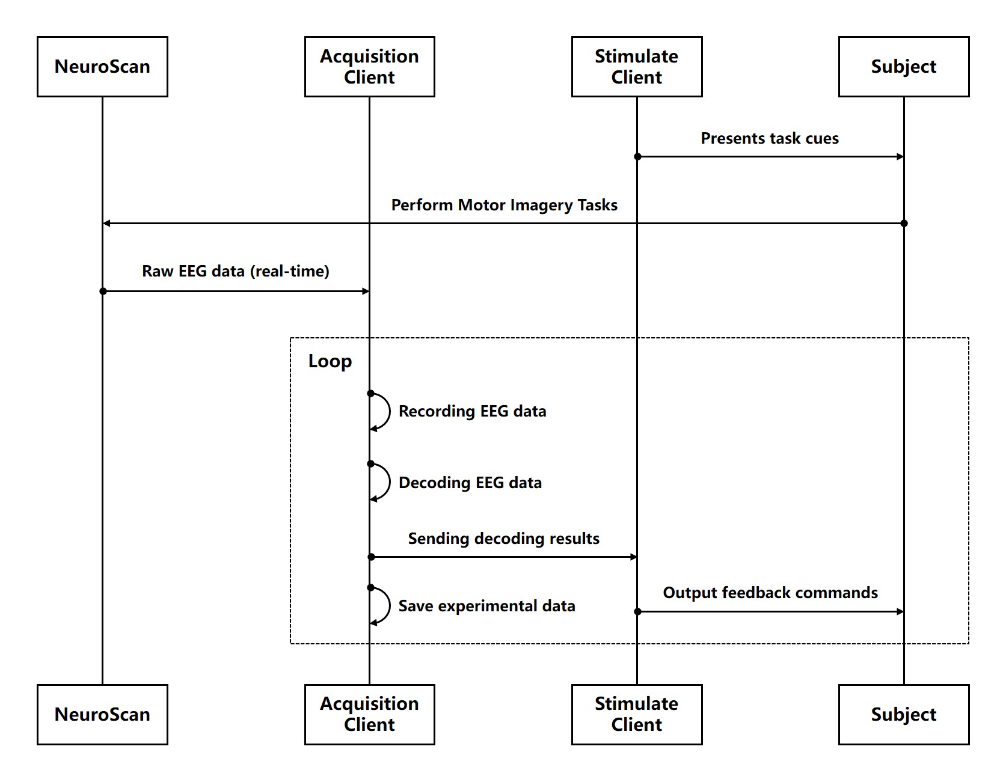

# Online Brain-Computer Interface Recognition and Feedback System

[](https://opensource.org/licenses/MIT)
[](https://www.mathworks.com/products/matlab.html)

English Version | [中文版本](./README.ch.md)

## Table of Contents
- [1. Project Overview](#1-project-overview)
- [2. Key Features](#2-key-features)
- [3. Installation & Dependencies](#3-installation--dependencies)
- [4. Usage Guide](#4-usage-guide)
- [5. System Architecture](#5-system-architecture)
- [6. Screenshots](#6-screenshots)
- [7. References](#7-references)
- [8. Related Resources](#8-related-resources)
- [9. Authors & Contributors](#9-authors--contributors)
- [10. License](#10-license)


<a id="1-project-overview"></a>

## 1. Project Overview

This project is a comprehensive Brain-Computer Interface (BCI) software system consisting of two collaborative MATLAB applications:

- **AcquisitionClient**: EEG Data Acquisition, Processing, and Feedback Control System  
  Implements real-time EEG acquisition, online processing, feature extraction, model training and evaluation, and motor imagery-based feedback control.

- **StimulateClient**: Motor Imagery Task Induction and Feedback Presentation System  
  Provides standardized motor imagery paradigms, audiovisual task cues, and real-time BCI decoding feedback.

The system offers a complete experimental platform for BCI research, particularly suitable for:
- 🧠 Motor imagery EEG decoding research
- 🤖 BCI algorithm development and evaluation
- 🔁 Neurofeedback training systems
- 🎮 Brain-controlled device interaction

[](https://www.bilibili.com/video/BV1UT42167xb/?vd_source=688a96f2275da749eb2dd276281528c4)


<a id="2-key-features"></a>

## 2. Key Features

### 🧪 AcquisitionClient - EEG Data Acquisition & Processing System

<div style="display: flex; justify-content: center; margin: 20px 0">
<div style="width: 95%">

| Category | Features | Technical Highlights |
|----------|----------|----------------------|
| **Data Acquisition** | Real-time NeuroScan EEG acquisition<br>Impedance monitoring<br>Multi-channel visualization | NeuroScan real-time data stream support<br>Low-latency acquisition |
| **Signal Processing** | Bandpass filtering (1-40Hz adjustable)<br>ICA artifact removal<br>Riemannian Spatial Filtering (RSF)<br>Common Spatial Patterns (CSP) | Real-time processing pipeline<br>Configurable parameters<br>Multiple spatial filtering algorithms |
| **Feature Analysis** | Time-domain (ERP)<br>Frequency-domain (PSD)<br>Time-frequency (ERSP)<br>Topographic mapping | Multi-dimensional feature extraction<br>Interactive visualization<br>Feature selection tools |
| **Machine Learning** | Model training (SBLEST, CTSSP)<br>Model evaluation (accuracy, confusion matrix)<br>Transfer learning (MEKT, RSFDA)<br>Real-time EEG decoding | Multiple classification algorithms<br>Transfer learning framework<br>Online adaptive learning |
| **Feedback Control** | UDP command transmission<br>Real-time decoding feedback<br>System monitoring | Low-latency communication <br>Configurable feedback parameters |

</div>
</div>

### Supported Classification Algorithms

<div style="display: flex; justify-content: center; margin: 20px 0">
<div style="width: 95%">

| Algorithm      | Key Parameters | Function Interfaces |
|----------------|----------------|---------------------|
| **CSP** | • `nFilters`: Number of filters<br>• `classifierType`: Classifier type | `model = csp_modeling(traindata, trainlabel, nFilters, classifierType)`<br>`[predlabel, decision_values, testacc] = csp_classify(model, testdata, testlabel)` |
| **FBCSP** | • `freqsbands`: Frequency band range array<br>• `nFilters`: Number of filters<br>• `fs`: Sampling rate | `model = fbcsp_modeling(traindata, trainlabel, nFilters, fs, freqsbands)`<br>`[predlabel, decision_values, testacc] = fbcsp_classify(model, testdata, testlabel)` |
| **FgMDM** | • `metric`: Distance metric | `model = fgmdm_modeling(traindata,trainlabel,metric)`<br>`[predlabel, decision_values, testacc] = fgmdm_classify(model, testdata, testlabel)` |
| **TSM** | • `classifierType`: Classifier type<br>• `optimize`: Whether to automatically optimize classifier parameters<br>• `timeLimit`: Maximum time limit for classifier parameter optimization | `model = tsm_modeling(traindata, trainlabel, classifierType, optimize, timeLimit)`<br>`[predlabel, decision_values, testacc] = tsm_classify(model, testdata, testlabel)` |
| **TRCA** | - | `model = trca_modeling(traindata, trainlabel)`<br>`[predlabel, decision_values, testacc] = trca_classify(model, testdata, testlabel)` |
| **DCPM** | - | `model = dcpm_modeling(traindata, trainlabel)`<br>`[predlabel, decision_values, testacc] = dcpm_classify(model, testdata, testlabel)` |
| **SBLEST** | • `tau`: Time delay parameter | `model = sblest_modeling(traindata, trainlabel, tau)`<br>`[predlabel, decision_values, testacc] = sblest_classify(model, testdata, testlabel)` |
| **CTSSP** | • `t_win`: Time window cell array<br>• `tau`: Time delay parameter | `model = ctssp_modeling(traindata, trainlabel, t_win, tau)`<br>`[predlabel, decision_values, testacc] = ctssp_classify(model, testdata, testlabel)` |
| **ENSEMBLE** | • `alg`: List of base algorithms<br>• `useDecisionValues`: Use decision values/predicted values | Meta-learning by integrating classification results of multiple base algorithms<br>`model = p_modeling(traindata, trainlabel, alg, varargin)`<br>`[predlabel, decision_values, testacc] = p_classify(model, testdata, testlabel)` |
| **RSFDA**<br>(for transfer learning) | • `fs`: Sampling rate<br>• `times`: Time window parameters<br>• `freqs`: Frequency band parameters<br>• `chans`: Channel parameters | `model = rsfda_modeling(Xs, Ys, Xt, Yt, fs, times, freqs, chans)`<br>`[predlabel, decision_values, testacc] = rsfda_classify(model, testdata, testlabel)` |
| **Stacking** | • `algs`: List of base algorithms<br>• `fs`: Sampling rate<br>• `times`: Time window parameters<br>• `freqs`: Frequency band parameters<br>• `chans`: Channel parameters | Meta-learning by integrating classification results of multiple base algorithms with time window, frequency band, and channel parameter configurations<br>`model = stacking_modeling(data, label, algs, fs, times, freqs, chans, varargin)`<br>`[predlabel, decision_values, testacc] = stacking_classify(model, testdata, testlabel)` |
| **Stacking**<br>(for transfer learning) | • `algs`: List of base algorithms<br>• `fs`: Sampling rate<br>• `times`: Time window parameters<br>• `freqs`: Frequency band parameters<br>• `chans`: Channel parameters | Meta-learning by integrating classification results of multiple base algorithms with time window, frequency band, and channel parameter configurations<br>`model = stacking_tlmodeling(Xs, Ys, Xt, Yt, algs, fs, times, freqs, chans, varargin)`<br>`[predlabel, decision_values, testacc] = stacking_tlclassify(model, testdata, testlabel)` |

> **Note**: The above function interfaces are examples. Please adjust according to the actual implementation when using. Some algorithm parameters are not listed; see the source code for details.

</div>
</div>

### 🎮 StimulateClient - Experiment Paradigm & Feedback System

<div style="display: flex; justify-content: center; margin: 20px 0">
<div style="width: 95%">

| Category | Features | Technical Highlights |
|----------|----------|----------------------|
| **Experiment Paradigms** | Left/right hand motor imagery<br>Audiovisual task cues<br>Parameter configuration | Standardized protocols<br>Precise timing control |
| **Feedback Presentation** | Real-time decoding visualization<br>Gamified feedback interface<br>Multimodal feedback (visual+auditory) | Immersive feedback experience<br>Customizable feedback formats |
| **Data Recording** | Automatic experiment logging<br>Participant response tracking<br>Timestamp synchronization | Standardized data formats<br>EEG-data synchronization |
| **System Control** | Experiment workflow management<br>UDP communication<br>System monitoring | Reliable communication protocol<br>Error handling mechanisms |

</div>
</div>

<a id="3-installation--dependencies"></a>

## 3. Installation & Dependencies

### System Requirements
- **OS**: Windows 10/11 (64-bit)
- **MATLAB**: R2021b or higher
- **Hardware**:
  - Processor: Intel Core i7 or equivalent
  - RAM: 16GB or higher
  - Storage: 1GB available space
  - NeuroScan EEG acquisition device

### Required Toolboxes

1. Signal Processing Toolbox
2. Statistics and Machine Learning Toolbox
3. Parallel Computing Toolbox (recommended)
4. Psychtoolbox-3 (recommended)

### Installation
1. Clone or download the repository：
   ```bash
   git clone https://github.com/PLC-TJU/NEUROSTREAM.git
   cd NEUROSTREAM
   ```
2. Add project paths in MATLAB：
    ```matlab
    % For Acquisition Host
    addpath(genpath('AcquisitionClient'));
    savepath;  % save path settings

    % For Feedback Host
    addpath(genpath('StimulateClient'));
    savepath;  % save path settings
   ```
3. Install required toolboxes：
    ```matlab
    % Check and install toolboxes
    toolboxes = {'Signal Processing Toolbox', ...
              'Statistics and Machine Learning Toolbox', ...
              'Parallel Computing Toolbox'};

    for i = 1:length(toolboxes)
        if ~license('test', toolboxes{i}) || isempty(ver(toolboxes{i}))
            warning('%s not installed, please install via MATLAB Add-On Explorer', toolboxes{i});
        end
    end

    % Install Psychtoolbox (optional)
    if ~exist('PsychtoolboxVersion', 'file')
        web('https://psychtoolbox.org/download.html', '-browser');
        disp('Please follow instructions to install Psychtoolbox');
    end
    ```


<a id="4-usage-guide"></a>

## 4. Usage Guide

**Pre-launch Setup**
1. Ensure NeuroScan device is connected with software (Scan/Curry) running
2. Enable real-time data transmission in NeuroScan software
3. Verify Acquisition and Feedback hosts are on same LAN
4. Configure firewall to allow UDP communication (default ports 4000 and 9095)

**AcquisitionClient Workflow**
```matlab
% Launch AcquisitionClient
AcquisitionClient;

% Typical workflow:
% 1. [Settings] -> Configure NeuroScan connection and subject info
% 2. [Data] -> Load historical data or acquire new training data
% 3. [Analysis] -> Perform feature analysis and visualization
% 4. [Model] -> Train classifier and evaluate performance
% 5. [Deploy] -> Activate real-time decoding engine
% 6. [Connect] -> Configure UDP feedback connection
% 7. [Control] -> Start real-time decoding and feedback
```

**StimulateClient Workflow**
```matlab
% Launch StimulateClient
StimulateClient;

% Typical workflow:
% 1. [Setup] -> Configure experiment parameters
% 2. [Network] -> Set UDP communication parameters
% 3. [Connect] -> Establish connection to AcquisitionClient
% 4. [Experiment] -> Start paradigm execution
% 5. [Monitor] -> Observe experiment progress and feedback
% 6. [Data] -> Save experiment data
```

**Collaborative Workflow**

<p align="center"> 
 
<br> 
<em>Figure 1: System Workflow</em> 
</p>

<a id="5-system-architecture"></a>

## 5. System Architecture

### Overall Architecture

<p align="center"> 

<br>
<em>Figure 2: Overall System Architecture</em>
</p>

### 采集端架构
```text
AcquisitionClient/
├── HelpSystem/                # Help documentation
│   ├── createAboutDialog.m    # About dialog
│   ├── createManualDialog.m   # User manual
├── Resources/                 # Resource files
│   ├── Icons/                 # Application icons
│   ├── Images/                # Application images
├── Utils/                     # Utility functions
│   ├── Machine_Learning_Classification/
│   │   ├── Classification/    # Classification algorithms
│   │   ├── Feature_Analysis/  # Feature analysis
│   │   ├── Model_Evaluation/  # Model evaluation
│   │   ├── Pre_Processing/    # Preprocessing methods
│   │   ├── model_training.m   # Model training
│   │   ├── online_classify.m  # Online classification
│   │   ├── tlmodel_training.m # Transfer learning model training
│   ├── NeuroScan/             # NeuroScan interface
│   ├── ...                    # Other utility functions
├── AcquisitionClient.mlapp    # Main application
├── ConfigManager.m            # Configuration manager
├── DataProcessor.m            # Data processor
├── FileManager.m              # File manager
├── NeuroScanClient.m          # NeuroScan client
└── UDPComm.m                  # UDP communication
```

### 反馈端架构
```text
StimulateClient/
├── Paradigms/                 # Experiment paradigms
│   ├── stimulate_auto.m       # Motor imagery game paradigm
│   └── stimulate_plc.m        # Motor imagery video paradigm(need Psychtoolbox-3)
├── Resources/                 # Resource files
│   ├── Audio/                 # Audio resources
│   ├── Images/                # Image resources
│   └── Videos/                # Video resources
├── Utils/                     # Utility functions
├── StimulateClient.mlapp      # Main application
```


<a id="6-screenshots"></a>

## 6. Screenshots

<p align="center">  

<br>
<em>Figure 3: AcquisitionClient Interface</em>
<br>
<br>

<br>
<em>Figure 4: StimulateClient Interface</em>
</p>


<a id="7-references"></a>

## 7. References
If you use this system or related algorithms in your research, please cite:

```bibtex
@article{pan2025rsf,
  title={Enhancing Motor Imagery EEG Classification with a Riemannian Geometry-Based Spatial Filtering (RSF) Method}, 
  author={Lincong, Pan and Kun, Wang and Yongzhi Huang and Xinwei, Sun and Jiayuan Meng and Weibo Yi and Minpeng, Xu and Tzyy-Ping Jung and Dong, Ming},
  journal={Neural Networks},
  year={2025},
  volume={188},
  pages={107511},
  doi={10.1016/j.neunet.2025.107511},
  publisher={Elsevier}
}
```
```bibtex
@article{pan2023rave,
  title={Riemannian geometric and ensemble learning for decoding cross-session motor imagery electroencephalography signals}, 
  author={Lincong, Pan and Kun, Wang and Lichao Xu and Xinwei, Sun and Weibo Yi and Minpeng, Xu and Dong, Ming},
  journal={Journal of Neural Engineering},
  year={2023},
  volume={20},
  number={6},
  pages={066011},
  doi={10.1088/1741-2552/ad0a01},
  publisher={IOP Publishing}
}
```
```bibtex
@article{pan2025rsfda,
  title={Cross-session Motor Imagery EEG Decoding Using Riemannian Spatial Filtering and Domain Adaptation}, 
  author={Pan, Lincong and Sun, Xinwei and Wang, Kun and Cao, Yupei and Xu, Minpeng and Ming, Dong},
  journal={Journal of Biomedical Engineering},
  year={2025},
  volume={42},
  number={2},
  pages={272-279},
  doi={10.7507/1001-5515.202411035},
  issn={1001-5515}
}
```
```bibtex
@article{pan2025ctssp,
  title={CTSSP: A Temporal-Spectral-Spatio Joint Optimization Algorithm for Motor Imagery EEG Decoding}, 
  author={Lincong, Pan and Kun, Wang and Weibo Yi and Yang Zhang and Minpeng, Xu and Dong, Ming},
  journal={TechRxiv},
  month={4},
  year={2025},
  doi={10.36227/techrxiv.174431208.89304915/v1}
}
```


<a id="8-related-resources"></a>

## 8. Related Resources
This project builds upon the following open-source projects and research resources:
- [</img>](https://github.com/PLC-TJU/NeuroDeckit) 
Comprehensive EEG Processing Toolbox
- [</img>](https://github.com/PLC-TJU/RSF)
Riemannian Spatial Filtering
- [</img>](https://github.com/PLC-TJU/RSFDA)
Riemann Spatial Filtering & Domain Adaptation
- [</img>](https://github.com/PLC-TJU/CTSSP)
Common Temporal-Spectral-Spatial Patterns
- [</img>](https://github.com/PLC-TJU/RAVE) 
Riemannian Geometry-based Adaptive Boosting and Voting Ensemble
- [</img>](https://github.com/alexandrebarachant/covariancetoolbox) 
Covariance Toolbox for Riemannian Geometry
- [</img>](https://github.com/EEGdecoding/Code-SBLEST) 
Sparse Bayesian Learning for EEG Classification
- [</img>](https://github.com/sccn/eeglab) 
Open-source MATLAB toolbox for EEG signal processing


<a id="9-authors--contributors"></a>

## 9. Authors & Contributors

**Core Developer**

- Author: Lincong Pan
- Email: panlincong@tju.edu.cn
- Institution: Tianjin University

**Other Contributors**
- None

<a id="10-license"></a> 

## 10. License

This project uses the MIT license.   
Please see the [LICENSE](./LICENSE) file for details.

```text
MIT License

Copyright (c) 2023-2025 Lincong Pan

Permission is hereby granted, free of charge, to any person obtaining a copy
of this software and associated documentation files (the "Software"), to deal
in the Software without restriction, including without limitation the rights
to use, copy, modify, merge, publish, distribute, sublicense, and/or sell
copies of the Software, and to permit persons to whom the Software is
furnished to do so, subject to the following conditions:

The above copyright notice and this permission notice shall be included in all
copies or substantial portions of the Software.

THE SOFTWARE IS PROVIDED "AS IS", WITHOUT WARRANTY OF ANY KIND, EXPRESS OR
IMPLIED, INCLUDING BUT NOT LIMITED TO THE WARRANTIES OF MERCHANTABILITY,
FITNESS FOR A PARTICULAR PURPOSE AND NONINFRINGEMENT. IN NO EVENT SHALL THE
AUTHORS OR COPYRIGHT HOLDERS BE LIABLE FOR ANY CLAIM, DAMAGES OR OTHER
LIABILITY, WHETHER IN AN ACTION OF CONTRACT, TORT OR OTHERWISE, ARISING FROM,
OUT OF OR IN CONNECTION WITH THE SOFTWARE OR THE USE OR OTHER DEALINGS IN THE
SOFTWARE.
```


## 
Last Updated: June 23, 2025  
Maintainer: Lincong Pan  
Project Home: https://github.com/PLC-TJU/NEUROSTREAM  
Contact: panlincong@tju.edu.cn  